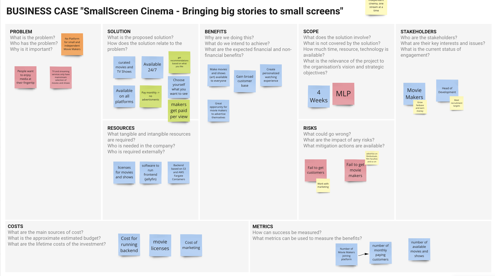

# CapStone-Project
Highly scalable and available jellyfin app running on AWS Fargate. Written in Terraform
The idea is to offer a possibilty of streaming movies and shows of smaller and independent movie makers that usually don't get an audience at Netflix and co. To learn more check out our Business Case Canvas:

The Backend will be hosted on AWS. To learn more about that have a look at our infrastructure diagram:

noch hinzufügen: 
- lambda backup funktion einfügen in diagramm done
- backup s3 einfügen in diagramm done
- add lambda schedule to diagram done
- s3 gateway abbilden evtl
- check security groups
- health checks
- sns zu diagram hinzufügen?